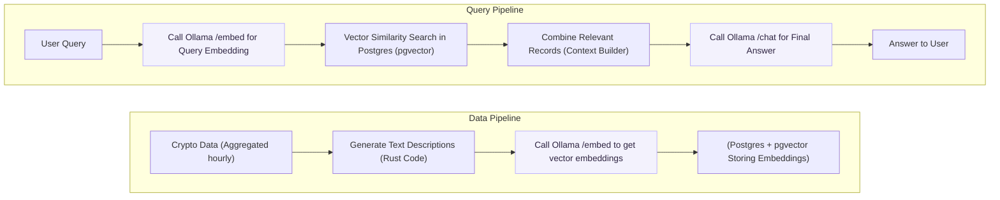

# Retrieval-Augmented Generation (RAG) Pipeline Overview 

***Project Progress***:  `[#---------]` 5%

Below is a Rust + Ollama architecture outline for generating embeddings using Ollama and storing them in Postgres via pgvector. This will enable to build a Retrieval-Augmented Generation (RAG) pipeline for crypto analytics data, all while leveraging Ollama’s local LLM capabilities for embeddings.

1. **Set Up Ollama** locally:  
   - `ollama serve` so that you can embed text (`POST /embed`) and do chat generation (`POST /chat`).

2. **Design & Populate Aggregates**:  
   - For each time bucket or transaction snapshot, build a descriptive string.  
   - Call Ollama’s embed endpoint, store the vector in Postgres with **pgvector**.

3. **Enable RAG**:  
   - Take user queries, embed them with Ollama, do a similarity search in Postgres.  
   - Combine top results into a context.  
   - Optionally feed that context to a generative LLM (Ollama or other) for the final polished answer.

4. **Deliver**:  
   - Provide a Rust-based CLI or a small HTTP/REST server.  
   - Return the answer to the user in JSON or text format.  
   - (Optional) Wrap in a simple front-end or integrate with another platform.

By using Ollama for embeddings, we'll keep everything local (no external API calls necessary), which can be more private and sometimes faster. And using **Rust** + **pgvector** ensures a high-performan

--

## Architecture

